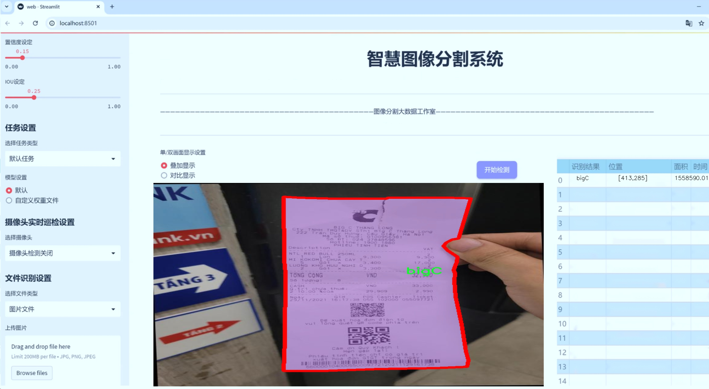

# 收据图像分割系统源码＆数据集分享
 [yolov8-seg-vanillanet＆yolov8-seg-C2f-RFCBAMConv等50+全套改进创新点发刊_一键训练教程_Web前端展示]

### 1.研究背景与意义

项目参考[ILSVRC ImageNet Large Scale Visual Recognition Challenge](https://gitee.com/YOLOv8_YOLOv11_Segmentation_Studio/projects)

项目来源[AAAI Global Al lnnovation Contest](https://kdocs.cn/l/cszuIiCKVNis)

研究背景与意义

随着信息技术的迅猛发展，数字化和自动化在各个行业中逐渐成为主流，尤其是在零售和财务管理领域。收据作为商业交易的重要凭证，承载着大量的关键信息，包括商家名称、商品明细、价格、日期等。传统的手工录入和信息提取方式不仅效率低下，而且容易出现人为错误，给企业的财务管理和数据分析带来了诸多挑战。因此，如何高效、准确地从收据图像中提取信息，成为了一个亟待解决的问题。

近年来，深度学习技术的快速发展为图像处理领域带来了新的机遇，尤其是目标检测和图像分割技术的应用，使得从复杂背景中提取特定目标成为可能。YOLO（You Only Look Once）系列模型因其高效的实时处理能力和较高的准确性，已广泛应用于各种视觉任务中。YOLOv8作为该系列的最新版本，结合了更为先进的特征提取和目标检测算法，具备了更强的图像理解能力。然而，针对特定领域如收据图像的分割任务，现有的YOLOv8模型在处理复杂背景和多样化格式的收据时，仍然存在一定的局限性。

本研究旨在基于改进的YOLOv8模型，构建一个高效的收据图像分割系统。通过对1400张收据图像的实例分割数据集进行深入分析，我们将重点关注六个主要类别的收据：aeon、bigC、circleK、coop、lotte和th。这些类别的多样性不仅反映了不同商家的收据格式和信息结构，也为模型的训练和测试提供了丰富的样本。通过对这些数据的处理和分析，我们希望能够提高模型在实际应用中的鲁棒性和准确性。

本研究的意义在于，首先，它将为收据信息的自动化提取提供一种新的解决方案，极大地提高企业在财务管理和数据分析中的效率。其次，改进的YOLOv8模型在收据图像分割中的应用，将为深度学习在图像处理领域的进一步发展提供有价值的实践经验和理论支持。此外，通过对不同商家收据的分类和分割，我们还可以为后续的机器学习和数据挖掘研究奠定基础，推动智能财务和智能零售的进一步发展。

综上所述，基于改进YOLOv8的收据图像分割系统不仅具有重要的理论研究价值，也具备广泛的实际应用前景。通过本研究，我们希望能够推动收据信息处理技术的进步，为相关领域的研究者和从业者提供新的思路和方法，助力数字化转型的进程。

### 2.图片演示




##### 注意：由于此博客编辑较早，上面“2.图片演示”和“3.视频演示”展示的系统图片或者视频可能为老版本，新版本在老版本的基础上升级如下：（实际效果以升级的新版本为准）

  （1）适配了YOLOV8的“目标检测”模型和“实例分割”模型，通过加载相应的权重（.pt）文件即可自适应加载模型。

  （2）支持“图片识别”、“视频识别”、“摄像头实时识别”三种识别模式。

  （3）支持“图片识别”、“视频识别”、“摄像头实时识别”三种识别结果保存导出，解决手动导出（容易卡顿出现爆内存）存在的问题，识别完自动保存结果并导出到tempDir中。

  （4）支持Web前端系统中的标题、背景图等自定义修改，后面提供修改教程。

  另外本项目提供训练的数据集和训练教程,暂不提供权重文件（best.pt）,需要您按照教程进行训练后实现图片演示和Web前端界面演示的效果。

### 3.视频演示

[3.1 视频演示](https://www.bilibili.com/video/BV1dvSeYDEA3/)

### 4.数据集信息展示

##### 4.1 本项目数据集详细数据（类别数＆类别名）

nc: 6
names: ['aeon', 'bigC', 'circleK', 'coop', 'lotte', 'th']


##### 4.2 本项目数据集信息介绍

数据集信息展示

在现代计算机视觉领域，图像分割技术的应用越来越广泛，尤其是在商业和零售行业中，收据图像的处理与分析显得尤为重要。为此，我们构建了一个名为“Receipt segmentation”的数据集，旨在为改进YOLOv8-seg模型提供高质量的训练数据，以实现对收据图像的精确分割和识别。该数据集包含六个不同的类别，分别是“aeon”、“bigC”、“circleK”、“coop”、“lotte”和“th”，这些类别代表了不同的零售商和超市的收据样本。

在数据集的构建过程中，我们注重多样性和代表性，确保收集到的收据图像涵盖了各种不同的格式、颜色、字体和布局。这些因素不仅影响了收据的可读性，也对图像分割模型的训练效果产生了重要影响。通过对不同商家的收据进行收集，我们能够为模型提供丰富的特征信息，从而提升其在实际应用中的表现。

每个类别的收据图像都经过精心标注，确保分割的准确性。标注过程中，我们采用了专业的图像标注工具，确保每个收据中的文本、图标和其他重要信息都能被准确地识别和分割。通过这种方式，我们的目标是让模型不仅能够识别出收据的整体结构，还能对其中的每一个细节进行精确的分割，从而为后续的文本识别和信息提取打下坚实的基础。

数据集的规模也是我们特别关注的一个方面。为了确保模型的泛化能力，我们收集了数千张来自不同商家的收据图像。这些图像不仅包括了标准的收据格式，还涵盖了各种特殊情况，如折扣信息、会员积分、二维码等。这种多样性使得模型在面对不同类型的收据时，能够更好地适应和处理，从而提高了实际应用中的鲁棒性。

在训练过程中，我们将数据集划分为训练集、验证集和测试集，以便于模型的评估和优化。训练集用于模型的学习，验证集用于调整超参数，而测试集则用于最终的性能评估。通过这种科学的划分方法，我们能够确保模型在训练过程中的有效性，并最终获得一个能够在实际场景中表现优异的收据图像分割系统。

总之，“Receipt segmentation”数据集的构建不仅为YOLOv8-seg模型的训练提供了丰富的素材，也为未来的研究和应用奠定了基础。我们相信，随着该数据集的不断完善和更新，收据图像分割技术将在商业智能、财务管理等领域发挥越来越重要的作用。通过对这一数据集的深入研究和应用，我们期待能够推动图像分割技术的进一步发展，为行业带来更多的创新和变革。


### 5.全套项目环境部署视频教程（零基础手把手教学）

[5.1 环境部署教程链接（零基础手把手教学）](https://www.bilibili.com/video/BV1jG4Ve4E9t/?vd_source=bc9aec86d164b67a7004b996143742dc)


[5.2 安装Python虚拟环境创建和依赖库安装视频教程链接（零基础手把手教学）](https://www.bilibili.com/video/BV1nA4VeYEze/?vd_source=bc9aec86d164b67a7004b996143742dc)

### 6.手把手YOLOV8-seg训练视频教程（零基础小白有手就能学会）

[6.1 手把手YOLOV8-seg训练视频教程（零基础小白有手就能学会）](https://www.bilibili.com/video/BV1cA4VeYETe/?vd_source=bc9aec86d164b67a7004b996143742dc)


按照上面的训练视频教程链接加载项目提供的数据集，运行train.py即可开始训练



     Epoch   gpu_mem       box       obj       cls    labels  img_size
     1/200     0G   0.01576   0.01955  0.007536        22      1280: 100%|██████████| 849/849 [14:42<00:00,  1.04s/it]
               Class     Images     Labels          P          R     mAP@.5 mAP@.5:.95: 100%|██████████| 213/213 [01:14<00:00,  2.87it/s]
                 all       3395      17314      0.994      0.957      0.0957      0.0843

     Epoch   gpu_mem       box       obj       cls    labels  img_size
     2/200     0G   0.01578   0.01923  0.007006        22      1280: 100%|██████████| 849/849 [14:44<00:00,  1.04s/it]
               Class     Images     Labels          P          R     mAP@.5 mAP@.5:.95: 100%|██████████| 213/213 [01:12<00:00,  2.95it/s]
                 all       3395      17314      0.996      0.956      0.0957      0.0845

     Epoch   gpu_mem       box       obj       cls    labels  img_size
     3/200     0G   0.01561    0.0191  0.006895        27      1280: 100%|██████████| 849/849 [10:56<00:00,  1.29it/s]
               Class     Images     Labels          P          R     mAP@.5 mAP@.5:.95: 100%|███████   | 187/213 [00:52<00:00,  4.04it/s]
                 all       3395      17314      0.996      0.957      0.0957      0.0845


### 7.50+种全套YOLOV8-seg创新点代码加载调参视频教程（一键加载写好的改进模型的配置文件）

[7.1 50+种全套YOLOV8-seg创新点代码加载调参视频教程（一键加载写好的改进模型的配置文件）](https://www.bilibili.com/video/BV1Hw4VePEXv/?vd_source=bc9aec86d164b67a7004b996143742dc)

### 8.YOLOV8-seg图像分割算法原理

原始YOLOv8-seg算法原理

YOLOv8-seg是2023年由Ultralytics发布的一款先进的目标检测与分割算法，它在YOLO系列的基础上进行了多项创新和优化，结合了YOLOv7、YOLOX、YOLOv6、PPYOLOE等前沿技术，形成了一种高效且精确的目标检测解决方案。YOLOv8-seg不仅能够进行目标检测，还具备了实例分割的能力，使其在处理复杂场景时表现出色。该算法的设计理念是通过整合多种先进的计算机视觉技术，提升模型的检测精度和速度，从而满足实时应用的需求。

YOLOv8-seg的核心在于其深度卷积神经网络结构。与传统的目标检测方法不同，YOLOv8-seg采用了全图输入的方式，直接在输入图像上进行目标检测和分割，而无需使用滑动窗口或区域提议。这种设计大大提高了检测的效率和精度，使得YOLOv8-seg能够在复杂的背景下准确识别和定位目标物体。算法的架构由多个模块组成，包括骨干特征提取网络、特征融合层和检测头层，每个模块都经过精心设计，以实现高效的信息传递和处理。

在骨干特征提取网络中，YOLOv8-seg使用了更深的卷积层和更高效的特征提取机制。通过引入C2F模块，YOLOv8-seg能够以更轻量化的方式提取特征，减少计算资源的消耗。这种模块的设计使得网络在保持高精度的同时，能够在移动设备或边缘计算平台上高效运行。此外，YOLOv8-seg还利用了特征金字塔网络（FPN）和路径聚合网络（PAN）来增强特征融合能力，从而提升了对不同尺度目标的检测性能。

特征融合层的设计是YOLOv8-seg的一大亮点。通过引入BiFPN网络，YOLOv8-seg实现了高效的双向跨尺度连接，能够在不同层次之间进行加权特征融合。这种方法不仅提高了特征提取的速度，还增强了模型对多尺度目标的适应能力，使得YOLOv8-seg在处理复杂场景时能够更加灵活和精准。

在检测头层，YOLOv8-seg采用了轻量化的解耦头结构，取代了传统的耦合头。这一创新使得模型能够更有效地进行目标检测和实例分割，减少了计算复杂度，同时提高了检测的准确性。解耦头的设计允许模型在处理目标时能够独立地进行分类和定位，从而进一步提升了检测性能。

YOLOv8-seg的损失函数设计也经过了优化，以适应目标检测和分割的双重任务。通过结合多种损失计算方式，YOLOv8-seg能够在训练过程中有效地平衡目标检测和实例分割的需求，确保模型在两项任务上都能达到良好的性能。这种灵活的损失函数设计，使得YOLOv8-seg在多种应用场景中都能表现出色，尤其是在实时检测和分割任务中。

值得一提的是，YOLOv8-seg在训练过程中采用了多尺度训练和测试策略，这一策略不仅提高了模型的鲁棒性，还增强了其在不同场景下的适应能力。通过在不同尺度下进行训练，YOLOv8-seg能够更好地学习到目标的特征，从而在实际应用中实现更高的检测精度。

在应用方面，YOLOv8-seg展现出了广泛的适用性。无论是在智能监控、自动驾驶，还是在农业自动化等领域，YOLOv8-seg都能够提供强大的视觉识别能力。以苹果采摘为例，利用YOLOv8-seg的视觉识别能力，自动采摘机器人能够快速准确地检测和定位苹果，从而提高采摘效率。此外，结合蚁群算法进行路径规划，进一步优化了采摘机器人的工作流程，使得整个系统更加高效和智能。

综上所述，YOLOv8-seg算法通过深度卷积神经网络、特征融合、轻量化设计以及优化的损失函数等多项创新，成功实现了目标检测与实例分割的高效结合。其在精度和速度上的显著提升，使得YOLOv8-seg成为当前目标检测领域的一项重要进展，具有广泛的应用前景和研究价值。随着技术的不断发展，YOLOv8-seg无疑将在未来的计算机视觉任务中发挥更大的作用，推动智能化应用的进一步发展。


### 9.系统功能展示（检测对象为举例，实际内容以本项目数据集为准）

图9.1.系统支持检测结果表格显示

  图9.2.系统支持置信度和IOU阈值手动调节

  图9.3.系统支持自定义加载权重文件best.pt(需要你通过步骤5中训练获得)

  图9.4.系统支持摄像头实时识别

  图9.5.系统支持图片识别

  图9.6.系统支持视频识别

  图9.7.系统支持识别结果文件自动保存

  图9.8.系统支持Excel导出检测结果数据


### 10.50+种全套YOLOV8-seg创新点原理讲解（非科班也可以轻松写刊发刊，V11版本正在科研待更新）

#### 10.1 由于篇幅限制，每个创新点的具体原理讲解就不一一展开，具体见下列网址中的创新点对应子项目的技术原理博客网址【Blog】：


[10.1 50+种全套YOLOV8-seg创新点原理讲解链接](https://gitee.com/qunmasj/good)

#### 10.2 部分改进模块原理讲解(完整的改进原理见上图和技术博客链接)【如果此小节的图加载失败可以通过CSDN或者Github搜索该博客的标题访问原始博客，原始博客图片显示正常】
### YOLOv8简介
根据官方描述，Yolov8是一个SOTA模型，它建立在Yolo系列历史版本的基础上，并引入了新的功能和改进点，以进一步提升性能和灵活性，使其成为实现目标检测、图像分割、姿态估计等任务的最佳选择。其具体创新点包括一个新的骨干网络、一个新的Ancher-Free检测头和一个新的损失函数，可在CPU到GPU的多种硬件平台上运行。
此外，Yolov8还有一个特点就是可扩展性，ultralytics没有直接将开源库命名为Yolov8，而是直接使用"ultralytcs"，将其定位为算法框架，而非某一个特定算法。这也使得Yolov8开源库不仅仅能够用于Yolo系列模型，而且能够支持非Yolo模型以及分类分割姿态估计等各类任务。
总而言之，Yolov8是Yolo系列模型的最新王者，各种指标全面超越现有对象检测与实例分割模型，借鉴了Yolov5、Yolov6、YoloX等模型的设计优点，在全面提升改进Yolov5模型结构的基础上实现，同时保持了Yolov5工程化简洁易用的优势。

#### Yolov8创新点
Yolov8主要借鉴了Yolov5、Yolov6、YoloX等模型的设计优点，其本身创新点不多，偏重在工程实践上，具体创新如下:
·提供了一个全新的SOTA模型（包括P5 640和P6 1280分辨率的目标检测网络和基于YOLACT的实例分割模型)。并且，基于缩放系数提供了N/S/M/L/X不同尺度的模型，以满足不同部署平台和应用场景的需求。
. Backbone:同样借鉴了CSP模块思想，不过将Yolov5中的C3模块替换成了C2f模块
实现了进—步轻量化，同时沿用Yolov5中的
SPPF模块，并对不同尺度的模型进行精心微调，不再是无脑式一套参数用于所有模型，大幅提升了模型性能。
。Neck:继续使用PAN的思想，但是通过对比YOLOv5与YOLOv8的结构图可以看到，YOLOv8移除了1*1降采样层。
·Head部分相比YOLOv5改动较大，Yolov8换成了目前主流的解耦头结构(Decoupled-Head)，将分类和检测头分离，同时也从Anchor-Based换成了Anchor-Free。
·Loss计算:使用VFLLoss作为分类损失(实际训练中使用BCE Loss);使用DFLLoss+CIOU Loss作为回归损失。
。标签分配: Yolov8抛弃了以往的loU分配或者单边比例的分配方式，而是采用Task-Aligned Assigner正负样本分配策略。
#### Yolov8网络结构
Yolov8模型网络结构图如下图所示。


### Diverse Branch Block简介
参考该博客提出的一种通用的卷积网络构造块用来在不增加任何推理时间的前提下提升卷积网络的性能。我们将这个块命名为分离分支块（Diverse Branch Block）。通过结合不同尺寸和复杂度的分离分支（包括串联卷积、多尺度卷积和平均池化层）来增加特征空间的方法，它提升了单个卷积的表达能力。完成训练后，一个DBB(Diverse Branch Block)可以被等价地转换为一个单独的卷积操作以方便部署。不同于那些新颖的卷积结构的改进方式，DBB让训练时微结构复杂化同时维持大规模结构，因此我们可以将它作为任意结构中通用卷积层的一种嵌入式替代形式。通过这种方式，我们能够将模型训练到一个更高的表现水平，然后在推理时转换成原始推理时间的结构。

 
主要贡献点：

（1） 我们建议合并大量的微结构到不同的卷积结构中来提升性能，但是维持原始的宏观结构。

（2）我们提出DBB，一个通用构造块结构，概括六种转换来将一个DBB结构转化成一个单独卷积，因为对于用户来说它是无损的。

（3）我们提出一个Inception-like DBB结构实例(Fig 1)，并且展示它在ImageNet、COCO detection 和CityScapes任务中获得性能提升。


#### 结构重参数化
本文和一个并发网络RepVGG[1]是第一个使用结构重参数化来命名该思路------使用从其他结构转化来的参数确定当前结构的参数。一个之前的工作ACNet[2]也可以被划分为结构重参数化，它提出使用非对称卷积块来增强卷积核的结构（i.e 十字形结构）。相比于DBB，它被设计来提升卷积网络（在没有额外推理时间损失的条件下）。这个流水线也包含将一个训练好的模型转化为另一个。但是，ACNet和DBB的区别是：ACNet的思想被激发是基于一个观察，这个观察是网络结构的参数在过去有更大的量级，因此寻找方法让参数量级更大，然而我们关注一个不同的点。我们发现 平均池化、1x1 conv 和 1x1-kxk串联卷积是更有效的，因为它们提供了不同复杂度的路线，以及允许使用更多训练时非线性化。除此以外，ACB结构可以看作是DBB结构的一种特殊形式，因为那个1xk和kx1卷积层能够被扩大成kxk（via Transform VI(Fig.2)），然后合并成一个平方核（via Transform II）。

 

#### 分离分支结构
卷积的线性性
一个卷积操作可以表示为 ，其中为输入tensor, 为输出tensor。卷积核表示为一个四阶tensor , 偏置为。将加偏置的操作表示为。

因为，在第j个输出通道（h,w）位置的值可以由以下公式给出：，其中表示输入帧I的第c个通道上的一个滑动窗，对应输出帧O的坐标（h,w）。从上式可以看出，卷积操作具有齐次性和加法性。


注意：加法性成立的条件是两个卷积具有相同的配置（即通道数、核尺寸、步长和padding等）。

#### 分离分支的卷积
在这一小节，我们概括六种转换形式（Fig.2）来转换一个具有batch normalization(BN)、branch addition、depth concatenation、multi-scale operations、avarage pooling 和 sequences of convolutions的DBB分支。


Transform I：a conv for conv-BN  我们通常会给一个卷积配备配备一个BN层，它执行逐通道正则化和线性尺度放缩。设j为通道索引，分别为累积的逐通道均值和标准差，分别为学习的尺度因子和偏置项，对应输出通道j为


卷积的齐次性允许我们融合BN操作到前述的conv来做推理。在实践中，我们仅仅建立一个拥有卷积核和偏置, 用从原始BN序列的参数转换来的值来赋值。我们为每个输出通道j构造


Transform II a conv for branch addition  卷积的加法性确保如果有两个或者多个具有相同配置的卷积层相加，我们能够将它们合并到一个单独的卷积里面。对于conv-BN，我们应该首先执行Transform I。很明显的，通过下面的公式我们能够合并两个卷积


上述公式只有在两个卷积拥有相同配置时才成立。尽管合并上述分支能够在一定程度上增强模型，我们希望结合不同分支来进一步提升模型性能。在后面，我们介绍一些分支的形式，它们能够等价地被转化为一个单独的卷积。在通过多个转化来为每一个分支构造KxK的卷积之后，我们使用Transform II 将所有分支合并到一个conv里面。

Transform III: a conv for sequential convolutions   我们能够合并一个1x1 conv-BN-kxk conv序列到一个kxk conv里面。我们暂时假设卷积是稠密的（即 组数 groups=1）。组数groups>1的情形将会在Transform IV中实现。我们假定1x1和kxk卷积层的核形状分别是DxCx1x1和ExDxKxK，这里D指任意值。首先，我们将两个BN层融合到两个卷积层里面，由此获得。输出是


我们期望用一个单独卷积的核和偏置来表达，设, 它们满足。对方程（8）应用卷积的加法性，我们有


因为是一个1x1 conv，它只执行逐通道线性组合，没有空间聚合操作。通过线性重组KxK卷积核中的参数，我们能够将它合并到一个KxK的卷积核里面。容易证明的是，这样的转换可以由一个转置卷积实现：


其中是由转置获得的tensor张量。方程（10）的第二项是作用于常量矩阵上的卷积操作，因此它的输出也是一个常量矩阵。用表达式来说明，设是一个常数矩阵，其中的每个元素都等于p。*是一个2D 卷积操作，W为一个2D 卷积核。转换结果就是一个常量矩阵，这个常量矩阵是p 与 所有核元素之和 的乘积，即


基于以上观察，我们构造。然后，容易证明。

因此我们有

显而易见地，对于一个zero-pads 的KxK卷积，方程（8）并不成立，因为并不对的结果做卷积操作(如果有一个零元素的额外的圈，方程（8）成立)。解决方案有A)用padding配置第一个卷积，第二个卷积不用，B)通过做pad操作。后者的一个有效实现是定制第一个BN层，为了（1）如通常的batch-normalize输入。（2）计算(通过方程（6）)。（3）用  pad batch-normalized结果，例如 用一圈 pad 每一个通道j 。

Transform IV: a conv for depth concatenation  Inception 单元使用深度concatenation来组合不同分支。当每个分支都只包含一个相同配置的卷积时，深度concatenation等价于一个卷积，它的核在不同的输出通道上concatenation（比如我们公式中的第一个轴）假设。我们concatenate它们到。显然地


Transform IV 可以非常方便地将Transform III 扩展到 groupwise（即 groups > 1） 的情景。直觉上，一个groupwise 卷积将输入分割成g个并行的组，单独卷积它们，然后concatenate形成输出。为了代替g-group卷积，我们建立一个DBB结构，这个结构的所有卷积层有相同的组g。为了转换一个1x1-KxK序列，我们等价地分割它们成为g组，单独执行Transform III, 然后concatenate获得输出（如图Fig3所示）。


Transform V: a conv for average pooling  一个作用于C通道的核尺寸为K，步长为s的平均池化层等价于一个拥有相同核尺寸K,步长s的卷积层。这样的核可以被构造为

  


就像一个通常的平均池化操作，当s>1时执行降采样操作，当s=1时保持相同尺寸。

Transform VI: a conv for multi-scale convolutions   考虑一个等价于一个拥有相同zero padding的 核。特别地，卷积是格外实用的，因为它们能够有效实现。应该对输入作pad操作来对齐滑动窗。


### 11.项目核心源码讲解（再也不用担心看不懂代码逻辑）

#### 11.1 demo_test_camera.py

以下是对给定代码的核心部分进行提炼和详细注释的结果：

```python
import cv2
import numpy as np
from PIL import ImageFont, ImageDraw, Image
from hashlib import md5
from model import Web_Detector
from chinese_name_list import Label_list

def generate_color_based_on_name(name):
    """
    根据名字生成稳定的颜色
    :param name: 字符串，表示对象的名称
    :return: 生成的颜色，格式为BGR
    """
    hash_object = md5(name.encode())  # 使用MD5哈希函数
    hex_color = hash_object.hexdigest()[:6]  # 取前6位16进制数
    r, g, b = int(hex_color[0:2], 16), int(hex_color[2:4], 16), int(hex_color[4:6], 16)
    return (b, g, r)  # OpenCV使用BGR格式

def draw_with_chinese(image, text, position, font_size=20, color=(255, 0, 0)):
    """
    在图像上绘制中文文本
    :param image: 输入图像
    :param text: 要绘制的文本
    :param position: 文本的位置
    :param font_size: 字体大小
    :param color: 文本颜色
    :return: 绘制文本后的图像
    """
    image_pil = Image.fromarray(cv2.cvtColor(image, cv2.COLOR_BGR2RGB))  # 转换为PIL格式
    draw = ImageDraw.Draw(image_pil)  # 创建绘图对象
    font = ImageFont.truetype("simsun.ttc", font_size, encoding="unic")  # 加载字体
    draw.text(position, text, font=font, fill=color)  # 绘制文本
    return cv2.cvtColor(np.array(image_pil), cv2.COLOR_RGB2BGR)  # 转换回OpenCV格式

def draw_detections(image, info):
    """
    在图像上绘制检测结果，包括边框、类别名称和其他信息
    :param image: 输入图像
    :param info: 检测信息，包括类别名称、边框、置信度等
    :return: 绘制后的图像
    """
    name, bbox = info['class_name'], info['bbox']  # 提取检测信息
    x1, y1, x2, y2 = bbox  # 边框坐标
    cv2.rectangle(image, (x1, y1), (x2, y2), color=(0, 0, 255), thickness=3)  # 绘制边框
    image = draw_with_chinese(image, name, (x1, y1 - 10), font_size=20)  # 绘制类别名称
    return image

def process_frame(model, image):
    """
    处理每一帧图像，进行目标检测
    :param model: 目标检测模型
    :param image: 输入图像
    :return: 处理后的图像
    """
    pre_img = model.preprocess(image)  # 预处理图像
    pred = model.predict(pre_img)  # 进行预测
    det_info = model.postprocess(pred)  # 后处理，获取检测信息

    for info in det_info:  # 遍历每个检测结果
        image = draw_detections(image, info)  # 绘制检测结果
    return image

if __name__ == "__main__":
    model = Web_Detector()  # 创建模型实例
    model.load_model("./weights/yolov8s-seg.pt")  # 加载模型权重

    # 摄像头实时处理
    cap = cv2.VideoCapture(0)  # 打开摄像头
    while cap.isOpened():
        ret, frame = cap.read()  # 读取帧
        if not ret:
            break
        processed_frame = process_frame(model, frame)  # 处理帧
        cv2.imshow('Camera Feed', processed_frame)  # 显示处理后的帧
        if cv2.waitKey(1) & 0xFF == ord('q'):  # 按'q'退出
            break
    cap.release()  # 释放摄像头
    cv2.destroyAllWindows()  # 关闭所有窗口
```

### 核心部分说明：
1. **生成颜色**：`generate_color_based_on_name` 函数使用哈希函数生成与对象名称相关的颜色，确保每个名称生成的颜色一致。
2. **绘制中文文本**：`draw_with_chinese` 函数将中文文本绘制到图像上，使用PIL库处理文本绘制。
3. **绘制检测结果**：`draw_detections` 函数负责在图像上绘制检测到的对象的边框和名称。
4. **处理帧**：`process_frame` 函数将输入图像传递给模型进行处理，并将检测结果绘制到图像上。
5. **主程序**：在主程序中，打开摄像头并实时处理每一帧图像，直到用户按下'q'键退出。

这个程序文件 `demo_test_camera.py` 是一个用于实时视频处理的 Python 脚本，主要利用 OpenCV 和深度学习模型进行目标检测和分割。程序的核心功能是从摄像头捕获视频流，处理每一帧图像，并在图像上绘制检测到的目标的边界框、类别名称以及一些相关的度量信息。

首先，程序导入了一些必要的库，包括 `random`、`cv2`（OpenCV）、`numpy`、`PIL`（用于处理图像和文本）以及 `hashlib`（用于生成哈希值）。此外，还导入了自定义的 `Web_Detector` 模型和 `Label_list` 类别标签。

程序中定义了几个辅助函数。`generate_color_based_on_name` 函数根据目标的名称生成一个稳定的颜色，这个颜色是通过对名称进行 MD5 哈希处理后得到的。`calculate_polygon_area` 函数计算多边形的面积，使用 OpenCV 的 `contourArea` 方法。`draw_with_chinese` 函数用于在图像上绘制中文文本，利用 PIL 库来处理字体和文本绘制。

`adjust_parameter` 函数根据图像的大小调整参数，以确保绘制的元素在不同分辨率下保持合适的比例。`draw_detections` 函数是程序的核心之一，它负责在图像上绘制检测到的目标，包括边界框、类别名称、面积、周长、圆度和颜色等信息。它会根据是否存在掩膜（mask）来决定绘制方式，如果有掩膜，则会填充多边形并计算相关的几何特征。

`process_frame` 函数用于处理每一帧图像。它首先对图像进行预处理，然后通过模型进行预测，接着将检测到的信息传递给 `draw_detections` 函数进行绘制。

在主程序部分，首先加载类别名称和模型权重。接着通过 OpenCV 打开摄像头，进入一个循环，持续读取摄像头的帧并进行处理。处理后的帧会通过 OpenCV 的 `imshow` 函数显示在窗口中，用户可以通过按下 'q' 键退出循环。

最后，程序释放摄像头资源并关闭所有 OpenCV 窗口。整体来看，这个程序实现了一个实时目标检测和分割的应用，能够在视频流中实时显示检测结果。

#### 11.2 ultralytics\utils\__init__.py

以下是代码中最核心的部分，并附上详细的中文注释：

```python
import os
import platform
import logging.config
from pathlib import Path
import torch
import yaml

# 设置一些常量
FILE = Path(__file__).resolve()  # 当前文件的绝对路径
ROOT = FILE.parents[1]  # YOLO的根目录
DEFAULT_CFG_PATH = ROOT / 'cfg/default.yaml'  # 默认配置文件路径

# 设置日志
def set_logging(name='ultralytics', verbose=True):
    """设置日志记录配置"""
    level = logging.INFO if verbose else logging.ERROR  # 根据verbose设置日志级别
    logging.config.dictConfig({
        'version': 1,
        'disable_existing_loggers': False,
        'formatters': {
            name: {
                'format': '%(message)s'}},
        'handlers': {
            name: {
                'class': 'logging.StreamHandler',
                'formatter': name,
                'level': level}},
        'loggers': {
            name: {
                'level': level,
                'handlers': [name],
                'propagate': False}}})

# 加载YAML配置文件
def yaml_load(file='data.yaml'):
    """从YAML文件加载数据"""
    with open(file, errors='ignore', encoding='utf-8') as f:
        return yaml.safe_load(f) or {}  # 返回字典，空文件返回空字典

# 检查当前操作系统是否为Ubuntu
def is_ubuntu() -> bool:
    """检查操作系统是否为Ubuntu"""
    return platform.system() == 'Linux' and os.path.exists('/etc/os-release') and 'ID=ubuntu' in open('/etc/os-release').read()

# 检查当前脚本是否在Google Colab中运行
def is_colab() -> bool:
    """检查当前脚本是否在Google Colab中运行"""
    return 'COLAB_RELEASE_TAG' in os.environ or 'COLAB_BACKEND_VERSION' in os.environ

# 主程序开始
set_logging()  # 设置日志
DEFAULT_CFG_DICT = yaml_load(DEFAULT_CFG_PATH)  # 加载默认配置
```

### 代码说明：
1. **导入模块**：导入了必要的模块，如`os`、`platform`、`logging.config`、`Path`、`torch`和`yaml`。

2. **常量设置**：
   - `FILE`：获取当前文件的绝对路径。
   - `ROOT`：获取YOLO的根目录。
   - `DEFAULT_CFG_PATH`：指定默认配置文件的路径。

3. **日志设置**：
   - `set_logging`函数用于配置日志记录，设置日志级别和格式。

4. **YAML加载**：
   - `yaml_load`函数用于从指定的YAML文件中加载数据，并返回一个字典。

5. **操作系统检查**：
   - `is_ubuntu`函数检查当前操作系统是否为Ubuntu。
   - `is_colab`函数检查当前脚本是否在Google Colab环境中运行。

6. **主程序**：
   - 调用`set_logging`设置日志。
   - 加载默认配置文件到`DEFAULT_CFG_DICT`。 

以上是代码的核心部分和详细注释，提供了对YOLO框架的基本设置和环境检查功能。

这个程序文件是Ultralytics YOLO项目中的一个初始化模块，主要用于设置和管理与YOLO模型相关的各种工具和功能。文件的开头部分导入了许多必要的库和模块，包括标准库和第三方库，例如`torch`、`cv2`、`yaml`等。

首先，文件定义了一些常量，例如多GPU训练的相关常量、项目的根目录、默认配置文件路径、线程数等。接着，设置了一些全局配置，包括打印选项、OpenCV的线程设置以及其他环境变量的配置。这些设置确保了在不同的环境中（如Colab、Kaggle、Docker等）都能正常运行。

接下来，文件定义了一些类和函数。`TQDM`类是对`tqdm`库的一个封装，提供了自定义的进度条显示。`SimpleClass`和`IterableSimpleNamespace`类提供了便于调试和使用的字符串表示和属性访问功能。`plt_settings`函数是一个装饰器，用于临时设置Matplotlib的绘图参数。

文件中还定义了一些与YAML文件操作相关的函数，例如`yaml_save`和`yaml_load`，用于保存和加载YAML格式的数据。这些函数支持处理文件路径和数据类型的验证，确保数据的正确性。

此外，文件中包含了一些检查系统环境的函数，例如`is_ubuntu`、`is_colab`、`is_kaggle`等，用于判断当前运行环境。这些函数有助于在不同平台上执行特定的操作。

文件还实现了日志记录功能，设置了一个自定义的日志过滤器`EmojiFilter`，以确保在Windows终端中记录的日志不包含表情符号。通过`set_logging`函数，配置了日志的格式和级别。

在多线程方面，文件定义了一个`ThreadingLocked`类，用于确保被装饰的函数在多线程环境中安全执行。还有一些函数用于检查网络连接、判断当前是否在pytest环境中运行等。

最后，文件中还包含了一些用于管理用户配置的功能，例如获取用户配置目录、管理设置的`SettingsManager`类等。文件的最后部分运行了一些初始化代码，包括检查首次安装步骤、设置Sentry错误跟踪等。

总的来说，这个文件为YOLO模型的使用提供了丰富的工具和功能，确保在不同环境下的兼容性和稳定性。

#### 11.3 ultralytics\utils\callbacks\__init__.py

以下是经过简化并添加详细中文注释的核心代码部分：

```python
# 导入必要的回调函数和默认回调
from .base import add_integration_callbacks, default_callbacks, get_default_callbacks

# 定义模块的公共接口，指定可以被外部访问的函数
__all__ = 'add_integration_callbacks', 'default_callbacks', 'get_default_callbacks'
```

### 代码注释详解：

1. **导入模块**：
   ```python
   from .base import add_integration_callbacks, default_callbacks, get_default_callbacks
   ```
   - 这一行代码从当前包的 `base` 模块中导入了三个函数：
     - `add_integration_callbacks`：用于添加集成回调的函数。
     - `default_callbacks`：默认回调的集合，可能包含一些预定义的回调函数。
     - `get_default_callbacks`：获取默认回调的函数，可能用于初始化或配置。

2. **定义公共接口**：
   ```python
   __all__ = 'add_integration_callbacks', 'default_callbacks', 'get_default_callbacks'
   ```
   - `__all__` 是一个特殊变量，用于定义当前模块中哪些名称是公共的，哪些可以被外部导入。
   - 这里指定了三个函数，使得当使用 `from module import *` 时，只有这三个函数会被导入，其他未列出的名称将不会被导入。这有助于控制模块的接口，避免不必要的名称冲突。

这个程序文件是Ultralytics YOLO项目中的一个初始化文件，位于`ultralytics/utils/callbacks`目录下。文件的主要功能是导入和暴露一些与回调相关的函数，以便在其他模块中使用。

首先，文件的开头包含了一条注释，说明这是Ultralytics YOLO项目的一部分，并且该项目遵循AGPL-3.0许可证。这意味着该项目是开源的，用户可以自由使用和修改，但需要遵循相应的许可证条款。

接下来，文件通过相对导入的方式引入了三个函数：`add_integration_callbacks`、`default_callbacks`和`get_default_callbacks`。这些函数可能是在同一目录下的`base`模块中定义的，具体功能需要查看`base.py`文件来了解。

最后，`__all__`变量被定义为一个元组，包含了上述三个函数的名称。这意味着当使用`from ultralytics.utils.callbacks import *`这样的语句时，只会导入这三个函数。这是一种控制模块导出内容的方式，有助于避免命名冲突和提高代码的可读性。

总体而言，这个文件的作用是组织和管理与回调相关的功能，使得其他模块能够方便地使用这些功能。

#### 11.4 ultralytics\models\yolo\segment\predict.py

以下是代码中最核心的部分，并附上详细的中文注释：

```python
from ultralytics.engine.results import Results  # 导入结果处理类
from ultralytics.models.yolo.detect.predict import DetectionPredictor  # 导入检测预测器基类
from ultralytics.utils import DEFAULT_CFG, ops  # 导入默认配置和操作工具

class SegmentationPredictor(DetectionPredictor):
    """
    扩展自 DetectionPredictor 类的分割预测器类，用于基于分割模型的预测。
    """

    def __init__(self, cfg=DEFAULT_CFG, overrides=None, _callbacks=None):
        """初始化 SegmentationPredictor，使用提供的配置、覆盖参数和回调函数。"""
        super().__init__(cfg, overrides, _callbacks)  # 调用父类构造函数
        self.args.task = 'segment'  # 设置任务类型为分割

    def postprocess(self, preds, img, orig_imgs):
        """对每个输入批次中的图像应用非最大抑制和处理检测结果。"""
        # 应用非最大抑制，过滤检测结果
        p = ops.non_max_suppression(preds[0],
                                    self.args.conf,  # 置信度阈值
                                    self.args.iou,  # IOU 阈值
                                    agnostic=self.args.agnostic_nms,  # 是否类别无关的 NMS
                                    max_det=self.args.max_det,  # 最大检测数量
                                    nc=len(self.model.names),  # 类别数量
                                    classes=self.args.classes)  # 指定的类别

        # 如果输入图像不是列表，则将其转换为 numpy 数组
        if not isinstance(orig_imgs, list):
            orig_imgs = ops.convert_torch2numpy_batch(orig_imgs)

        results = []  # 存储结果的列表
        proto = preds[1][-1] if len(preds[1]) == 3 else preds[1]  # 获取掩膜原型

        # 遍历每个预测结果
        for i, pred in enumerate(p):
            orig_img = orig_imgs[i]  # 获取原始图像
            img_path = self.batch[0][i]  # 获取图像路径

            if not len(pred):  # 如果没有检测到目标
                masks = None  # 掩膜设置为 None
            elif self.args.retina_masks:  # 如果使用 Retina 掩膜
                # 调整边界框到原始图像的尺寸
                pred[:, :4] = ops.scale_boxes(img.shape[2:], pred[:, :4], orig_img.shape)
                # 处理掩膜
                masks = ops.process_mask_native(proto[i], pred[:, 6:], pred[:, :4], orig_img.shape[:2])  # HWC
            else:  # 否则使用常规掩膜处理
                masks = ops.process_mask(proto[i], pred[:, 6:], pred[:, :4], img.shape[2:], upsample=True)  # HWC
                # 调整边界框到原始图像的尺寸
                pred[:, :4] = ops.scale_boxes(img.shape[2:], pred[:, :4], orig_img.shape)

            # 将结果存储到结果列表中
            results.append(Results(orig_img, path=img_path, names=self.model.names, boxes=pred[:, :6], masks=masks))
        
        return results  # 返回处理后的结果
```

### 代码核心部分说明：
1. **类 SegmentationPredictor**：这是一个用于图像分割的预测器类，继承自 `DetectionPredictor`，它实现了分割模型的预测功能。
2. **初始化方法 `__init__`**：在初始化时设置任务类型为分割，并调用父类的初始化方法。
3. **后处理方法 `postprocess`**：该方法对模型的预测结果进行后处理，包括应用非最大抑制、调整边界框、处理掩膜等，最终返回处理后的结果列表。

这个程序文件 `ultralytics/models/yolo/segment/predict.py` 定义了一个用于图像分割的预测类 `SegmentationPredictor`，它继承自 `DetectionPredictor` 类。该类主要用于基于分割模型进行预测，具体实现了图像分割的后处理和结果处理功能。

在文件的开头，首先导入了一些必要的模块和类，包括 `Results`、`DetectionPredictor` 和一些工具函数 `ops`。这些导入为后续的类定义和方法实现提供了基础。

`SegmentationPredictor` 类的构造函数 `__init__` 接受三个参数：`cfg`（配置）、`overrides`（覆盖配置）和 `_callbacks`（回调函数）。在构造函数中，调用了父类的构造函数，并将任务类型设置为 `'segment'`，表明该类专注于图像分割任务。

`postprocess` 方法是该类的核心功能之一。它负责对模型的预测结果进行后处理。具体来说，该方法首先调用 `ops.non_max_suppression` 函数对预测结果进行非极大值抑制，以去除冗余的检测框。接着，它检查输入的原始图像是否为列表格式，如果不是，则将其转换为 NumPy 数组格式。

然后，方法会根据预测结果的不同情况处理掩膜（masks）。如果没有检测到任何目标，掩膜将被设置为 `None`。如果启用了 `retina_masks`，则使用原生处理函数生成掩膜；否则，使用标准的掩膜处理函数。无论哪种情况，预测框的坐标都会根据原始图像的尺寸进行缩放。

最后，方法将处理后的结果存储在 `results` 列表中，每个结果都包含原始图像、图像路径、类别名称、检测框和掩膜。最终，该方法返回包含所有处理结果的列表。

总体而言，这个文件实现了一个功能强大的图像分割预测器，能够有效地处理输入图像并输出分割结果，适用于各种计算机视觉任务。

#### 11.5 ultralytics\models\sam\predict.py

以下是经过简化和注释的核心代码部分，主要保留了 `Predictor` 类及其关键方法，并添加了详细的中文注释：

```python
import numpy as np
import torch
import torch.nn.functional as F
import torchvision

from ultralytics.data.augment import LetterBox
from ultralytics.engine.predictor import BasePredictor
from ultralytics.utils import ops
from .build import build_sam

class Predictor(BasePredictor):
    """
    Predictor类用于Segment Anything Model (SAM)，扩展自BasePredictor。

    该类提供了一个用于图像分割任务的模型推理接口，支持多种提示类型，如边界框、点和低分辨率掩码。
    """

    def __init__(self, cfg=DEFAULT_CFG, overrides=None, _callbacks=None):
        """
        初始化Predictor，设置配置、覆盖和回调。

        Args:
            cfg (dict): 配置字典。
            overrides (dict, optional): 覆盖默认配置的值字典。
            _callbacks (dict, optional): 自定义行为的回调函数字典。
        """
        if overrides is None:
            overrides = {}
        overrides.update(dict(task='segment', mode='predict', imgsz=1024))
        super().__init__(cfg, overrides, _callbacks)
        self.args.retina_masks = True  # 设置为True以获得最佳结果
        self.im = None  # 输入图像
        self.features = None  # 提取的图像特征
        self.prompts = {}  # 存储提示信息
        self.segment_all = False  # 控制是否分割所有对象

    def preprocess(self, im):
        """
        对输入图像进行预处理，以便模型推理。

        Args:
            im (torch.Tensor | List[np.ndarray]): 输入图像，支持BCHW格式的张量或HWC格式的numpy数组列表。

        Returns:
            (torch.Tensor): 预处理后的图像张量。
        """
        if self.im is not None:
            return self.im  # 如果已经处理过，直接返回
        not_tensor = not isinstance(im, torch.Tensor)
        if not_tensor:
            im = np.stack(self.pre_transform(im))  # 转换为张量格式
            im = im[..., ::-1].transpose((0, 3, 1, 2))  # 转换通道顺序
            im = np.ascontiguousarray(im)
            im = torch.from_numpy(im)

        im = im.to(self.device)  # 移动到指定设备
        im = im.half() if self.model.fp16 else im.float()  # 根据模型精度转换
        if not_tensor:
            im = (im - self.mean) / self.std  # 归一化
        return im

    def inference(self, im, bboxes=None, points=None, labels=None, masks=None, multimask_output=False, *args, **kwargs):
        """
        基于给定的输入提示执行图像分割推理。

        Args:
            im (torch.Tensor): 预处理后的输入图像张量。
            bboxes (np.ndarray | List, optional): 边界框。
            points (np.ndarray | List, optional): 指示对象位置的点。
            labels (np.ndarray | List, optional): 点提示的标签。
            masks (np.ndarray, optional): 低分辨率掩码。
            multimask_output (bool, optional): 是否返回多个掩码。

        Returns:
            (tuple): 包含输出掩码、质量分数和低分辨率logits的元组。
        """
        # 如果有存储的提示，则覆盖输入提示
        bboxes = self.prompts.pop('bboxes', bboxes)
        points = self.prompts.pop('points', points)
        masks = self.prompts.pop('masks', masks)

        if all(i is None for i in [bboxes, points, masks]):
            return self.generate(im, *args, **kwargs)  # 如果没有提示，生成掩码

        return self.prompt_inference(im, bboxes, points, labels, masks, multimask_output)  # 使用提示进行推理

    def generate(self, im, crop_n_layers=0, crop_overlap_ratio=512 / 1500, crop_downscale_factor=1, points_stride=32, points_batch_size=64, conf_thres=0.88, stability_score_thresh=0.95, crop_nms_thresh=0.7):
        """
        使用Segment Anything Model (SAM)执行图像分割。

        Args:
            im (torch.Tensor): 输入图像张量。
            crop_n_layers (int): 额外掩码预测的层数。
            crop_overlap_ratio (float): 裁剪区域之间的重叠比例。
            points_stride (int): 每侧采样的点数。
            points_batch_size (int): 同时处理的点的批大小。
            conf_thres (float): 掩码质量预测的置信度阈值。
            stability_score_thresh (float): 掩码稳定性过滤的阈值。
            crop_nms_thresh (float): NMS的IoU阈值。

        Returns:
            (tuple): 包含分割掩码、置信度分数和边界框的元组。
        """
        self.segment_all = True  # 设置为分割所有对象
        ih, iw = im.shape[2:]  # 获取输入图像的高度和宽度
        # 生成裁剪区域
        crop_regions, layer_idxs = generate_crop_boxes((ih, iw), crop_n_layers, crop_overlap_ratio)
        pred_masks, pred_scores, pred_bboxes = [], [], []  # 存储预测结果

        for crop_region, layer_idx in zip(crop_regions, layer_idxs):
            x1, y1, x2, y2 = crop_region  # 裁剪区域的坐标
            crop_im = F.interpolate(im[..., y1:y2, x1:x2], (ih, iw), mode='bilinear', align_corners=False)  # 裁剪并插值
            # 进行推理并获取掩码和分数
            crop_masks, crop_scores, crop_bboxes = self.prompt_inference(crop_im, points=points, multimask_output=True)

            # 处理掩码和边界框
            pred_masks.append(crop_masks)
            pred_bboxes.append(crop_bboxes)
            pred_scores.append(crop_scores)

        # 合并所有预测结果
        pred_masks = torch.cat(pred_masks)
        pred_bboxes = torch.cat(pred_bboxes)
        pred_scores = torch.cat(pred_scores)

        return pred_masks, pred_scores, pred_bboxes  # 返回最终结果

    def setup_model(self, model, verbose=True):
        """
        初始化Segment Anything Model (SAM)以进行推理。

        Args:
            model (torch.nn.Module): 预训练的SAM模型。
            verbose (bool): 如果为True，则打印设备信息。
        """
        device = select_device(self.args.device, verbose=verbose)  # 选择设备
        if model is None:
            model = build_sam(self.args.model)  # 构建模型
        model.eval()  # 设置为评估模式
        self.model = model.to(device)  # 移动模型到设备
        self.mean = torch.tensor([123.675, 116.28, 103.53]).view(-1, 1, 1).to(device)  # 归一化均值
        self.std = torch.tensor([58.395, 57.12, 57.375]).view(-1, 1, 1).to(device)  # 归一化标准差
```

### 代码说明
1. **Predictor 类**：负责图像分割的推理，继承自 `BasePredictor`。
2. **初始化方法**：设置模型的配置、覆盖和回调，并初始化一些必要的属性。
3. **预处理方法**：将输入图像转换为模型可以接受的格式，包括归一化和维度调整。
4. **推理方法**：根据给定的提示（如边界框、点等）执行图像分割推理。
5. **生成方法**：对整个图像进行分割，支持裁剪区域的处理。
6. **模型设置方法**：初始化并配置SAM模型，设置设备和归一化参数。

以上是代码的核心部分和详细注释，帮助理解其功能和实现。

这个程序文件 `ultralytics\models\sam\predict.py` 是用于实现“Segment Anything Model”（SAM）的预测逻辑，主要用于图像分割任务。SAM 是一种先进的图像分割模型，具备可提示的分割和零样本性能。该模块包含了执行分割所需的预测逻辑和辅助工具，旨在支持高性能、实时的图像分割任务。

文件首先导入了一些必要的库，包括 NumPy、PyTorch 和 torchvision，以及 Ultralytics 框架中的一些模块和工具。接着定义了一个 `Predictor` 类，继承自 `BasePredictor`，该类为图像分割任务提供了模型推理的接口。`Predictor` 类的构造函数初始化了一些属性，包括配置字典、覆盖的参数、回调函数等，并设置了一些与任务相关的设置。

`preprocess` 方法用于对输入图像进行预处理，包括图像的变换和归一化，支持不同格式的输入。`pre_transform` 方法则执行初步的图像变换，如调整大小，以便后续处理。

`inference` 方法是执行图像分割推理的核心，基于输入的提示（如边界框、点和掩码）进行分割。它会调用 `prompt_inference` 方法，该方法利用 SAM 的架构，结合图像编码器、提示编码器和掩码解码器进行实时分割。

`generate` 方法用于对整个图像进行分割，利用 SAM 的高级架构和实时性能，支持对图像进行裁剪以实现更精细的分割。该方法处理多个参数，包括裁剪层数、重叠比例、置信度阈值等，以优化分割结果。

`setup_model` 方法用于初始化 SAM 模型，分配设备并设置图像归一化的必要参数。`postprocess` 方法则用于后处理 SAM 的推理输出，将掩码和边界框缩放到原始图像大小，并应用阈值过滤掩码预测。

此外，`setup_source` 方法配置数据源，`set_image` 方法设置单张图像进行推理，`set_prompts` 方法允许提前设置提示。`remove_small_regions` 方法用于对生成的分割掩码进行后处理，移除小的、孤立的区域，并执行非极大值抑制（NMS）以消除重复的边界框。

整体而言，这个文件实现了一个灵活且高效的图像分割工具，能够处理多种输入提示，支持实时推理和高质量的分割结果。

### 12.系统整体结构（节选）

### 程序整体功能和构架概括

该程序是一个基于Ultralytics YOLO和Segment Anything Model（SAM）的计算机视觉项目，主要用于实时图像处理和分割。整体架构包括多个模块，每个模块负责特定的功能。程序通过摄像头捕获视频流，并利用深度学习模型进行目标检测和图像分割。以下是各个模块的功能概述：

1. **demo_test_camera.py**：实现实时视频捕获和处理，利用YOLO模型进行目标检测和分割，并在视频流中显示检测结果。
2. **ultralytics/utils/__init__.py**：提供了一系列工具和配置，支持项目的全局设置、日志记录、YAML文件操作等功能，确保在不同环境中的兼容性。
3. **ultralytics/utils/callbacks/__init__.py**：管理和导入与回调相关的功能，便于在模型训练和推理过程中使用回调机制。
4. **ultralytics/models/yolo/segment/predict.py**：实现YOLO模型的图像分割预测逻辑，处理输入图像并返回分割结果，支持多种输入提示。
5. **ultralytics/models/sam/predict.py**：实现Segment Anything Model的预测逻辑，支持基于提示的图像分割，提供高效的实时推理能力。

### 文件功能整理表

| 文件路径                                          | 功能描述                                                                                      |
|--------------------------------------------------|-----------------------------------------------------------------------------------------------|
| `demo_test_camera.py`                            | 实现实时视频捕获和处理，利用YOLO模型进行目标检测和分割，并在视频流中显示检测结果。             |
| `ultralytics/utils/__init__.py`                 | 提供工具和配置，支持全局设置、日志记录、YAML文件操作等功能，确保项目在不同环境中的兼容性。   |
| `ultralytics/utils/callbacks/__init__.py`      | 管理和导入与回调相关的功能，便于在模型训练和推理过程中使用回调机制。                        |
| `ultralytics/models/yolo/segment/predict.py`    | 实现YOLO模型的图像分割预测逻辑，处理输入图像并返回分割结果，支持多种输入提示。              |
| `ultralytics/models/sam/predict.py`              | 实现Segment Anything Model的预测逻辑，支持基于提示的图像分割，提供高效的实时推理能力。      |

这个表格清晰地展示了每个文件的功能，有助于理解整个程序的架构和各个模块之间的关系。

注意：由于此博客编辑较早，上面“11.项目核心源码讲解（再也不用担心看不懂代码逻辑）”中部分代码可能会优化升级，仅供参考学习，完整“训练源码”、“Web前端界面”和“50+种创新点源码”以“14.完整训练+Web前端界面+50+种创新点源码、数据集获取”的内容为准。

### 13.图片、视频、摄像头图像分割Demo(去除WebUI)代码

在这个博客小节中，我们将讨论如何在不使用WebUI的情况下，实现图像分割模型的使用。本项目代码已经优化整合，方便用户将分割功能嵌入自己的项目中。
核心功能包括图片、视频、摄像头图像的分割，ROI区域的轮廓提取、类别分类、周长计算、面积计算、圆度计算以及颜色提取等。
这些功能提供了良好的二次开发基础。

### 核心代码解读

以下是主要代码片段，我们会为每一块代码进行详细的批注解释：

```python
import random
import cv2
import numpy as np
from PIL import ImageFont, ImageDraw, Image
from hashlib import md5
from model import Web_Detector
from chinese_name_list import Label_list

# 根据名称生成颜色
def generate_color_based_on_name(name):
    ......

# 计算多边形面积
def calculate_polygon_area(points):
    return cv2.contourArea(points.astype(np.float32))

...
# 绘制中文标签
def draw_with_chinese(image, text, position, font_size=20, color=(255, 0, 0)):
    image_pil = Image.fromarray(cv2.cvtColor(image, cv2.COLOR_BGR2RGB))
    draw = ImageDraw.Draw(image_pil)
    font = ImageFont.truetype("simsun.ttc", font_size, encoding="unic")
    draw.text(position, text, font=font, fill=color)
    return cv2.cvtColor(np.array(image_pil), cv2.COLOR_RGB2BGR)

# 动态调整参数
def adjust_parameter(image_size, base_size=1000):
    max_size = max(image_size)
    return max_size / base_size

# 绘制检测结果
def draw_detections(image, info, alpha=0.2):
    name, bbox, conf, cls_id, mask = info['class_name'], info['bbox'], info['score'], info['class_id'], info['mask']
    adjust_param = adjust_parameter(image.shape[:2])
    spacing = int(20 * adjust_param)

    if mask is None:
        x1, y1, x2, y2 = bbox
        aim_frame_area = (x2 - x1) * (y2 - y1)
        cv2.rectangle(image, (x1, y1), (x2, y2), color=(0, 0, 255), thickness=int(3 * adjust_param))
        image = draw_with_chinese(image, name, (x1, y1 - int(30 * adjust_param)), font_size=int(35 * adjust_param))
        y_offset = int(50 * adjust_param)  # 类别名称上方绘制，其下方留出空间
    else:
        mask_points = np.concatenate(mask)
        aim_frame_area = calculate_polygon_area(mask_points)
        mask_color = generate_color_based_on_name(name)
        try:
            overlay = image.copy()
            cv2.fillPoly(overlay, [mask_points.astype(np.int32)], mask_color)
            image = cv2.addWeighted(overlay, 0.3, image, 0.7, 0)
            cv2.drawContours(image, [mask_points.astype(np.int32)], -1, (0, 0, 255), thickness=int(8 * adjust_param))

            # 计算面积、周长、圆度
            area = cv2.contourArea(mask_points.astype(np.int32))
            perimeter = cv2.arcLength(mask_points.astype(np.int32), True)
            ......

            # 计算色彩
            mask = np.zeros(image.shape[:2], dtype=np.uint8)
            cv2.drawContours(mask, [mask_points.astype(np.int32)], -1, 255, -1)
            color_points = cv2.findNonZero(mask)
            ......

            # 绘制类别名称
            x, y = np.min(mask_points, axis=0).astype(int)
            image = draw_with_chinese(image, name, (x, y - int(30 * adjust_param)), font_size=int(35 * adjust_param))
            y_offset = int(50 * adjust_param)

            # 绘制面积、周长、圆度和色彩值
            metrics = [("Area", area), ("Perimeter", perimeter), ("Circularity", circularity), ("Color", color_str)]
            for idx, (metric_name, metric_value) in enumerate(metrics):
                ......

    return image, aim_frame_area

# 处理每帧图像
def process_frame(model, image):
    pre_img = model.preprocess(image)
    pred = model.predict(pre_img)
    det = pred[0] if det is not None and len(det)
    if det:
        det_info = model.postprocess(pred)
        for info in det_info:
            image, _ = draw_detections(image, info)
    return image

if __name__ == "__main__":
    cls_name = Label_list
    model = Web_Detector()
    model.load_model("./weights/yolov8s-seg.pt")

    # 摄像头实时处理
    cap = cv2.VideoCapture(0)
    while cap.isOpened():
        ret, frame = cap.read()
        if not ret:
            break
        ......

    # 图片处理
    image_path = './icon/OIP.jpg'
    image = cv2.imread(image_path)
    if image is not None:
        processed_image = process_frame(model, image)
        ......

    # 视频处理
    video_path = ''  # 输入视频的路径
    cap = cv2.VideoCapture(video_path)
    while cap.isOpened():
        ret, frame = cap.read()
        ......
```


### 14.完整训练+Web前端界面+50+种创新点源码、数据集获取


# [下载链接：https://mbd.pub/o/bread/Zp6YlJlw](https://mbd.pub/o/bread/Zp6YlJlw)